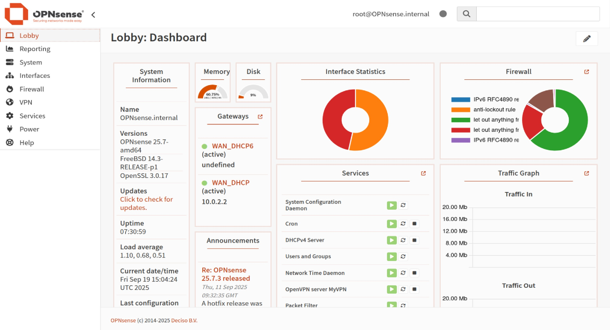

# 🔐 Secure Network Infrastructure with OPNsense

 **The full project report (with screenshots) is available here:**  
- [OPNsense_Report_docx.docx](OPNsense_Report_docx.docx)

  

This project demonstrates how to build a secure, segmented, and production-ready network architecture using [OPNsense](https://opnsense.org) — a powerful open-source firewall and routing platform. The lab setup follows real-world security best practices, including zone isolation, firewall policy enforcement, VPN remote access, IDS/IPS monitoring, and centralized logging.

>  This is a hands-on InfoSec/DevSecOps lab project, ideal for training and showcasing portfolio skills.

---

##  Lab Architecture

The virtual lab environment includes:

- **OPNsense Firewall** — core security gateway (firewall, NAT, DHCP, IDS/IPS, VPN).
- **Ubuntu Server** — internal target host in LAN or DMZ.
- **Kali Linux** — attacker machine for simulating threat scenarios.

 **Virtualization platform:** VirtualBox.

---

##  Network Design

The network follows a multi-zone structure:

| Zone   | Purpose                      | Subnet              |
|--------|------------------------------|---------------------|
| WAN    | External internet access     | via NAT             |
| LAN    | Internal users & services    | `192.168.1.0/24`    |
| DMZ    | Public-facing servers        | `192.168.20.0/24`   |
| MGMT   | Secure administration        | `192.168.99.0/24`   |

🔧 VLANs were implemented using **802.1Q** for logical segmentation.

---

##  Firewall Model

- **Default-deny policy** on all interfaces.
- **LAN:** allowed outbound DNS/HTTPS only.
- **DMZ:** outbound HTTP/HTTPS only; no access to LAN or MGMT.
- **MGMT:** GUI/SSH allowed only from trusted IPs.
- **GeoIP filtering** blocks high-risk countries.
- **Aliases** were used to simplify rule management.

 All firewall rules follow the **least privilege** principle.

---

##  Network Services

- **DHCP (ISC DHCPv4):** enabled per zone with custom ranges.
- **NAT:** automatic outbound NAT applied.
- **DNS forwarding & NTP** configured for all clients.

---

##  IDS/IPS (Intrusion Detection/Prevention)

- **Suricata** installed and running on WAN, LAN, and DMZ.
- **IPS mode enabled** for real-time blocking of threats.
- Subscribed rule feeds: ET Open, Feodo Tracker, ThreatFox, Abuse.ch.
- Logs are ready for SIEM or centralized analysis.

---

##  VPN Access (OpenVPN)

A secure remote access VPN was implemented using OpenVPN:

- A local **Certificate Authority (CA)** and server/client certificates were created.
- **User-based authentication** was enabled for `vpnuser`.
- **TUN interface**, UDP port, and subnet topology were configured.
- A pre-packaged `.ovpn` client file was exported and tested.

---

## Centralized Logging

- Logs from OPNsense, Suricata, and OpenVPN are sent via **Syslog (UDP/514)**.
- Log format is **RFC5424-compliant**, ensuring compatibility with SIEM systems.

---

##  Project Outcomes

 Key results of the project:

- Built a **secure and segmented network architecture** using OPNsense.
- Applied strict **firewall policies** across multiple zones.
- Enabled **NAT, DHCP, VLAN, and VPN remote access**.
- Integrated **Suricata IDS/IPS** for live threat detection and prevention.
- Configured **centralized logging** to monitor and audit network events.

---

##  Related Files

- [`OPNsense_Report_docx.docx`](OPNsense_Report_docx.docx) — complete technical documentation with screenshots and configs  

##  Technical Summary

This project delivers a fully configured, secure network infrastructure built from scratch, including:

- Multi-zone segmentation (LAN, DMZ, MGMT, WAN) using 802.1Q VLANs;
- Default-deny firewall policy with strict rule enforcement per interface;
- DHCP, DNS Forwarder, and NTP configuration for internal clients;
- Automatic and static NAT rule configuration;
- Firewall rule sets per zone using aliases and GeoIP filtering;
- Deployment and integration of Suricata IDS/IPS on multiple interfaces with updated rule feeds;
- OpenVPN server setup with internal Certificate Authority (CA) and client profile export;
- Centralized logging via Syslog (UDP/514) in RFC5424 format.

All configurations were implemented manually in a VirtualBox environment and documented step-by-step.  
The project demonstrates practical use of OPNsense for securing and segmenting network infrastructure.
